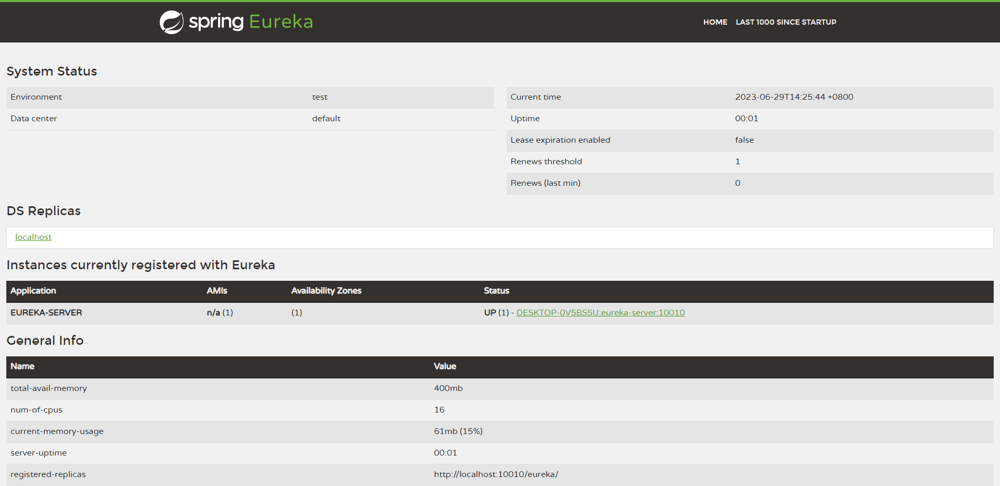
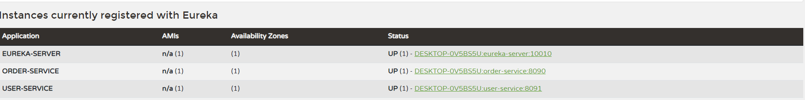
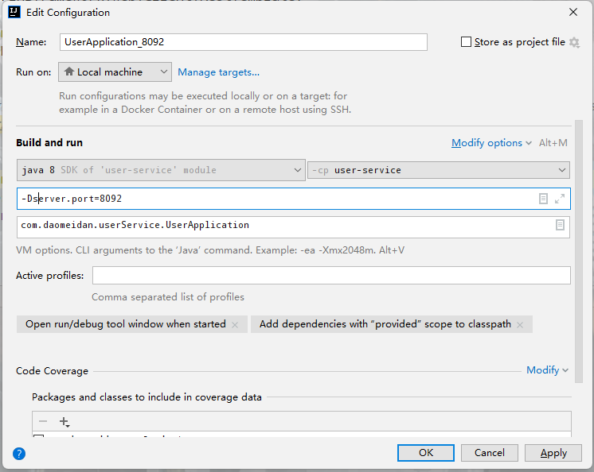
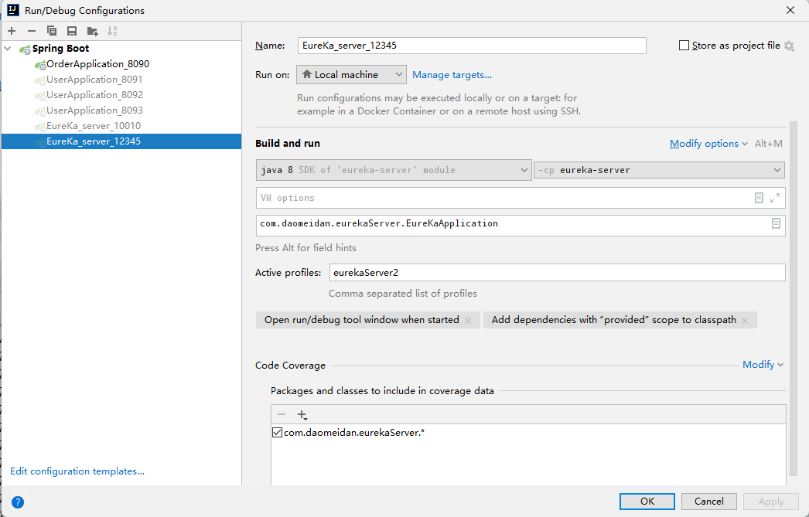

# Spring Cloud微服务框架学习

## 一、项目初始化

初始化项目结构较为简单，父工程下有两个初始化子工程：

1. user-service(用户服务)
2. order-service(订单服务)

> 注意：
>
> 1. springboot和springCloud之间需要有合适的版本对应，负责会出现不兼容的情况，[版本查询](https://spring.io/projects/spring-cloud)，我这里使用的是`spring-boot-starter-parent 2.7.5`和`spring-cloud-dependencies 2021.0.6`
> 2. 本项目主要是入门SpringCloud微服务，本身项目结构和语法规范并不是很强

## 二、项目完善

### 2.1 阶段一：服务注册中心

实际的业务需求是不同服务之间需要相互调用服务，http请求做远程调用是与语言无关的调用，只要知道对方的**ip、端口、接口路径、请求参数**即可。调用有以下几种方法：

#### a. RestTemplate

spring框架自身提供的支持HTTP请求的工具，可以发起get、post等方式的请求，[相关文章](https://blog.csdn.net/Sophia_0331/article/details/121196840)

##### 业务实现

1. 注册RestTemplate

   ```java
   package com.daomeidan.orderService.config;
   
   import org.springframework.context.annotation.Bean;
   import org.springframework.context.annotation.Configuration;
   import org.springframework.web.client.RestTemplate;
   
   @Configuration
   public class RestTemplateConfig {
   
       @Bean
       public RestTemplate restTemplate(){
           return new RestTemplate();
       }
   }
   ```

2. 实现远程调用

   ```java
   @GetMapping("{orderId}")
   public Order queryOrderByUserId(@PathVariable("orderId") Long orderId) {
       // 根据id查询订单并返回
       Order order = orderService.queryOrderById(orderId);
       //使用RestTemplate远程调用服务
       String url = "http://127.0.0.1:8091/user/" + order.getUserId();
       User user = restTemplate.getForObject(url, User.class);//返回值类型
       //赋值
       order.setUser(user);
       return order;
   }
   ```

##### 问题

1. 很明显的问题就是，请求url等信息耦合度太高，修改麻烦，不好管理。
2. 当用户服务集群部署时，并不能负载均衡调用
3. 并不能知道用户服务是否健康

#### 服务注册中心引入

##### 角色

在服务调用关系中，会有两个不同的角色：

**服务提供者**：一次业务中，被其它微服务调用的服务。（提供接口给其它微服务）

**服务消费者**：一次业务中，调用其它微服务的服务。（调用其它微服务提供的接口）

但是，服务提供者与服务消费者的角色并不是绝对的，而是相对于业务而言。如果服务A调用了服务B，而服务B又调用了服务C，服务B的角色是什么？

- 对于A调用B的业务而言：A是服务消费者，B是服务提供者
- 对于B调用C的业务而言：B是服务消费者，C是服务提供者

##### 思路

1. 每个服务将自己的信息注册到同一位置，方便进行管理；
2. 消费者只需要去去该位置调用对应的服务提供者即可

#### b. Eureka注册中心


##### 运行方式

1. user-service服务实例启动后，将自己的信息注册到eureka-server（Eureka服务端）。这个叫服务注册
2. eureka-server保存服务名称到服务实例地址列表的映射关系
3. order-service根据服务名称，从实例列表中利用负载均衡算法选中一个实例地址向该实例地址发起远程调用，拉取实例地址列表。这个叫服务发现或服务拉取
4. user-service会每隔一段时间（默认30秒）向eureka-server发起请求，报告自己状态，称为心跳。当超过一定时间没有发送心跳时，eureka-server会认为微服务实例故障，将该实例从服务列表中剔除order-service拉取服务时，就能将故障实例排除了

> 注意：
>
> 1. 一个微服务，既可以是服务提供者，又可以是服务消费者，因此eureka将服务注册、服务发现等功能统一封装到了eureka-client端

##### 服务搭建流程

###### 1. Eureka的服务端搭建

1. 创建一个单独的子工程，作为Eureka的服务端，引入依赖

   ```xml
   <dependencies>
       <!--eureka服务端-->
       <dependency>
           <groupId>org.springframework.cloud</groupId>
           <artifactId>spring-cloud-starter-netflix-eureka-server</artifactId>
       </dependency>
   </dependencies>
   ```

2. 🔥编写启动配置类，添加一个`@EnableEurekaServer`注解，开启eureka的注册中心功能

3. 编写yml配置文件

   ```yml
   server:
     port: 10010
   
   spring:
     application:
       name: eureka-server
   
   eureka:
     client:
       service-url:
         #defaultZone:指定Eureka注册中心的地址,当Eureka不是使用默认端口时,可以在服务客户端以及服务提供端进行配置实现Eureka的自定义端口
         #defaultZone是一个Map集合类型，可以实现注册中心集群搭建
         defaultZone: http://127.0.0.1:10010/eureka/
   ```

**服务启动**

启动服务，根据自己配置的地址访问，我这里配置的是[10010端口](http://127.0.0.1:10010/eureka/)



==至此，注册中心服务搭建成功，下面需要将服务注册到服务中心中==

###### 2. 服务注册

1. 服务注册，在`user-service`和`order-service`两个服务中引入依赖

   ```xml
   <dependency>
       <groupId>org.springframework.cloud</groupId>
       <artifactId>spring-cloud-starter-netflix-eureka-client</artifactId>
   </dependency>
   ```

2. 修改两个服务的配置文件

   ```yml
   spring:
     application:
       name: userservice #当前服务的服务名，用于注册中心中调用该服务时使用
   eureka:
     client:
       service-url:
         defaultZone: http://127.0.0.1:10086/eureka
   ```

**再次启动服务**

发现`user-service`和`order-service`两个服务已经被注册到Eureka服务注册中心中



---

为了模拟集群的业务场景，我们可以借助IDEA，创建多个服务提供者：

1. 右击服务，选择`Copy Configuration`,修改服务的端口号



依次启动服务即可

###### 3.服务调用

服务的提供者被注册到注册中心EureKa，此时可以通过调用注册到注册中心的`user-service`服务获取到用户信息，且这个过程中框架为我们实现了负载均衡

1. 在`order-service`的`OrderApplication`中，给RestTemplate这个Bean添加一个`@LoadBalanced`注解

   ```java
   @Configuration
   public class RestTemplateConfig {
   
       /**
        * spring提供的支持HTTP请求的工具，详情:https://blog.csdn.net/Sophia_0331/article/details/121196840
        * @return
        */
       @Bean
       @LoadBalanced //实现负载均衡
       public RestTemplate restTemplate(){
           return new RestTemplate();
       }
   }
   ```

2. 更改业务请求的路径

   ```java
   @GetMapping("{orderId}")
   public Order queryOrderByUserId(@PathVariable("orderId") Long orderId) {
       // 根据id查询订单并返回
       Order order = orderService.queryOrderById(orderId);
   
       //调用注册中心上的user-service服务
       String url = "http://user-service/user/" + order.getUserId();
       User user = restTemplate.getForObject(url, User.class);
   
       order.setUser(user);
   
       return order;
   
   }
   ```

##### 高可用集群搭建

1. 修改yml配置文件，主要模拟多台eureka服务器搭建集群

   ```yml
   spring:
     application:
       name: eureka-server
     profiles:
       active: eurekaServer1
   ---
   server:
     port: 10010
   
   eureka:
     instance:
       hostname: eureka-server-01
       lease-expiration-duration-in-seconds: 90 # Eureka Server默认清除client的时间
       lease-renewal-interval-in-seconds: 30 # 默认心跳时间30s
     client:
       # 表示是否注册自身到eureka服务器
       register-with-eureka: false
       #false表示自己端就是注册中心，我的职责就是维护服务实例，并不需要去检索服务
       fetch-registry: false
       service-url:
         #defaultZone:指定Eureka注册中心的地址,当Eureka不是使用默认端口时,可以在服务客户端以及服务提供端进行配置实现Eureka的自定义端口
         #defaultZone是一个Map集合类型，可以实现注册中心集群搭建
         defaultZone: http://eureka-server-02:12345/eureka
   
   ---
   server:
     port: 12345
   
   eureka:
     instance:
       hostname: eureka-server-02
       lease-expiration-duration-in-seconds: 90 # Eureka Server默认清除client的时间
       lease-renewal-interval-in-seconds: 30 # 默认心跳时间30s
     client:
       # 表示是否注册自身到eureka服务器
       register-with-eureka: false
       #false表示自己端就是注册中心，我的职责就是维护服务实例，并不需要去检索服务
       fetch-registry: false
       service-url:
         #defaultZone:指定Eureka注册中心的地址,当Eureka不是使用默认端口时,可以在服务客户端以及服务提供端进行配置实现Eureka的自定义端口
         #defaultZone是一个Map集合类型，可以实现注册中心集群搭建
         defaultZone: http://eureka-server-01:10010/eureka
   ```

2. 修改`user-service`和`order-service`两个服务中的配置文件

   ```yml
   eureka:
     client:
       service-url:
         defaultZone: http://127.0.0.1:10010/eureka, http://eureka-server-02:12345/eureka
   ```

3. 启动配置

   

   

